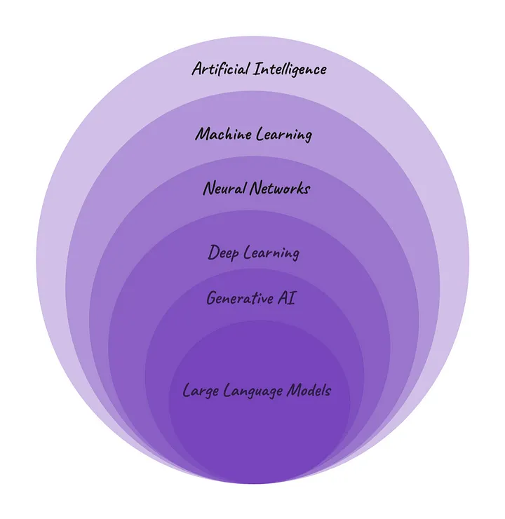

# LLM(Largest Language Model)
## Applied LLM Foundation and real world use cases
the history content and fundamental concepts of AI ,ML,NeuralNetworks(NN),and generative AI(GenAI),the core attributes of LLM's,facing on their Scale ,the role of model parameters

## History and Background

**Large Language Models (LLMs)** It represent a significant evolution in the field of natural language processing (NLP) and artificial intelligence (AI). Their development stems from advances in neural network architectures, availability of large-scale data, and computational power.

**Artificial Intelligence(AI)** it is a branch of computer science focused on creating machines that can think and act like humans. It encompasses a range of technologies, from virtual assistants like Siri and Alexa to customer service chatbots on websites.

**Machine Learning (ML)** is a subfield of AI that involves creating models that can learn from data and make predictions or decisions without explicit programming. In traditional programming, developers provide specific instructions, whereas ML algorithms learn patterns from data. ML includes different types of learning, such as supervised, unsupervised, and reinforcement learning. An example of an ML-based application is Google's Smart Reply.

**Neural Networks (NNs)** also known as Artificial Neural Networks (ANNs), are a subset of ML, inspired by the structure of the human brain. NNs consist of interconnected artificial neurons arranged in layers: an input layer, one or more hidden layers, and an output layer. These networks are the foundation of deep learning algorithms.

**Deep Learning (DL)** is a specialized subset of NNs, characterized by neural networks with more than three hidden layers. DL is well-suited for complex problems and is widely used in technologies such as image recognition and object detection in smartphones, as well as online language translation services like Google Translate.

**Generative AI (GenAI)** is a subset of DL, focusing on generating various types of content, including text, imagery, audio, and video. Generative AI learns from existing content to create new outputs.

**Large Language Models (LLMs)** are a specific type of generative AI designed to generate human-like text based on patterns learned from vast amounts of textual data during training. While ML encompasses various algorithms and applications, LLMs specialize in natural language processing.

## Training LLM's: 
it involves teaching the models to understanding and generate human-like text through a multistep process
**Input text provision:** 
LLMs are initially exposed to extensive text data, encompassing various sources such as books, articles, and websites.
**Optimizing Model Weights:**
The model comprises different weights associated with its parameters, reflecting the significance of various features.
**Fine-tuning Parameter Values:**
LLMs continuously adjust parameter values based on error feedback received during predictions.

**LLM performance is influenced by two main factors:**

1. **Model Architecture**: The complexity and design of the LLM architecture affect its ability to understand language nuances.
   
2. **Dataset Quality**: The quality and diversity of the dataset used for training are crucial in shaping the model's language comprehension.

Training a private LLM requires significant computational resources and expertise, lasting from days to weeks based on complexity and dataset size.Fine-tuning allows customization for specific tasks using small sets of supervised data after initial training.

Three common learning models for LLMs are:
- **Zero-shot learning**: Base LLMs can handle various requests without explicit training, often through prompts.
- **Few-shot learning**: Providing a few relevant training examples significantly improves the base model's performance in a specific domain.
- **Domain Adaptation**: Extending from few-shot learning, practitioners adjust a base model's parameters using additional data specific to the application or domain.

## LLM Real World Use Cases

Large Language Models (LLMs) have diverse real-world applications:

1. **Content Generation**: LLMs excel in creating high-quality and contextually relevant content for marketing, social media, and communication materials.
2. **Language Translation**: They enhance language translation tasks by providing accurate and context-aware translations, benefiting businesses in multilingual environments.
3. **Text Summarization**: LLMs efficiently summarize lengthy documents, extracting key information and maintaining the core message for improved information consumption.
4. **Question Answering and Chatbots**: They generate relevant responses for question answering tasks, enabling natural and context-aware conversations in systems like customer support and educational platforms.
5. **Content Moderation**: LLMs analyze text for inappropriate content, aiding in content moderation on platforms like social media and online forums.
6. **Information Retrieval**: They enhance information retrieval systems by understanding user queries and retrieving relevant data, improving search accuracy in platforms like search engines and databases.
7. **Educational Tools**: LLMs support educational tools by providing natural language interfaces for learning platforms, assisting students in generating summaries, answering questions, and engaging in interactive learning experiences.

| No. | Use Case              | Description                                                                                   |
|-----|-----------------------|-----------------------------------------------------------------------------------------------|
| 1   | Content Generation     | Craft human-like text, videos, code, and images based on provided instructions.              |
| 2   | Language Translation   | Translate languages from one to another, enhancing global communication and outreach.        |
| 3   | Text Summarization     | Summarize lengthy texts, simplifying comprehension by highlighting key points.                |
| 4   | Question Answering and Chatbots | Provide relevant answers to queries, leveraging vast knowledge for engaging conversations. |
| 5   | Content Moderation     | Assist in content moderation by identifying and filtering inappropriate or harmful language. |
| 6   | Information Retrieval  | Retrieve relevant information from large datasets or documents, improving search accuracy.   |
| 7   | Educational Tools      | Tutor, provide explanations, and generate learning materials for personalized learning experiences. |

**LLM Challenges**

1. **Data Challenges**:
   - Data Bias: Biases in training data leading to biased outputs.
   - Limited World Knowledge: LLMs may lack real-world understanding.
   - Dependency on Data Quality: Performance relies on quality training data.

2. **Ethical and Social Challenges**:
   - Ethical Concerns: Responsible use in sensitive contexts.
   - Bias Amplification: Training biases leading to unfair outputs.
   - Legal and Privacy Issues: Copyright violations and privacy risks.
   - User Privacy: Risks with generating text from user inputs.

3. **Technical Challenges**:
   - Computational Resources: High computing power needed.
   - Interpretability: Understanding complex model decisions.
   - Evaluation: Assessing models across tasks and domains.
   - Fine-tuning: Adapting models to specific tasks.
   - Contextual Understanding: Maintaining context over long passages.
   - Robustness: Vulnerability to manipulations and maintaining coherence.

4. **Deployment Challenges**:
   - Scalability: Ensuring efficient scaling for increased demand.
   - Latency: Minimizing response time for quick interactions.
   - Monitoring and Maintenance: Tracking performance and regular upkeep.
   - Integration: Smooth integration with existing systems.
   - Cost Management: Optimizing deployment costs.
   - Security: Addressing vulnerabilities and risks.
   - Interoperability: Compatibility with other tools.
   - User Feedback: Incorporating feedback for model improvement.
   - Regulatory Compliance: Meeting data protection standards.
   - Dynamic Content Handling: Managing text generation in changing environments.
